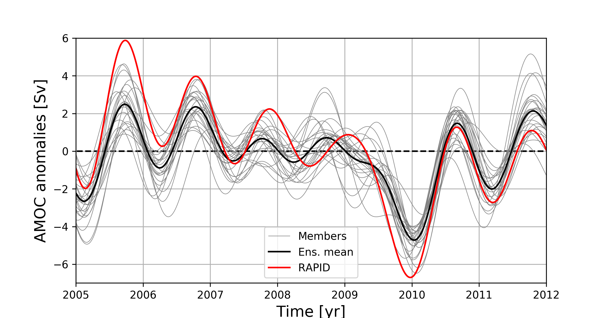

# CHAOCEAN PROJECT



The goal of this project is to disentangle the low-frequency oceanic variability in the subtropcial North Atlantic as locally generated through intrinsic ocean processes, locally driven by the atmosphere or controlled by remote processes. 

In depth details of the simulations performed for this project are available at [files/chaocean_project_report.pdf](files/chaocean_project_report.pdf).
 


## Configuration

For this project, we set up an eddy-resolving (1/12) ocean regional configuration of the North Atlantic [20S, 55N] with the MITgcm, coupled the atmospheric boundary layer model CheapAML. We have run 4 different experiments of this configuration, which differ from one another by their surface forcing and open boundary conditions; their are either fully varying (realistic) or yearly repeating. All of these experiments have been integrated over 50 years (1963-2012) with a 12-member ensemble strategy; within an ensemble, all members are exposed to the same forcing (surface and open boundaries), but differ by their initial conditions at Janury, 1st 1963. 

The 4 ensembles are referred to as:

|                                 | Fully varying atmosphere  | Yearly repeating atmosphere  |
|---------------------------------|---------------------------|------------------------------|
| Fully varying Open Boundaries   |       ORAR                |        ORAC                  |
| Yearly repeating Open Boundaries|       OCAR                |        OCAC                  |


- (27/09/2019) The ensemble ORAR has been extended to 24 members (see  [files/chaocean_project_report.pdf](files/chaocean_project_report.pdf)).

- (04/11/2019) The ensemble OCAC has been extended to 24 members with 12 new Macro Initial Conditions (see  [files/chaocean_project_report.pdf](files/chaocean_project_report.pdf)).

## Initial conditions, open boundaries and atmospheric forcing

Scripts used to build the inputs (forcing and initial conditions), along with their description, can be found in ```./mk_config/```.

- Initial conditions: The configuration is first spun-up for 5 years (1958-1963) from the ORCA12.L46-MJM88 initial conditions. Then, all ensembles are integrated forward in time for 50 years (1963-2012) with a 12-member ensemble strategy. The 12 initial conditions are common to all ensembles, and are meant to reflect the spread induced by the growth of small, dynamically consistent perturbations decorrelated at seasonal time scales (further details in [mk_config/](mk_config/)).

- Open boundaries: Oceanic velocities (U, V) and tracers (T, S) are restored with a 6 hours relaxation time scale toward oceanic state derived from the 55-year long 1/12 horizontal resolution ocean-only global configuration ORCA12.L46-MJM88. Open boundary conditions are applied every 5 days and linearly interpolated in between. 

- Atmospheric forcing: At the surface, the ocean model is coupled to the atmospheric boundary layer model CheapAML. Atmospheric surface temperature and relative humidity respond to ocean surface structures by exchanges computed according to the COARE3 flux formula, but are strongly restored toward prescribed values over land. Other variables (downward longwave and solar shortwave radiation, precipitations) are prescribed everywhere. Atmospheric reanalysis products used in CheapAML originate from the Drakkar forcing set (DFS4.4, Brodeau et al, 2010; Dussin et al, 2016). Pricipitations are from DFS5.2 due to better time resolution.


## Configuration files for MITgcm

All files needed to set up and run this configuration are provided in [./MITgcm/](./MITgcm/). Specific piece of code are in ```./code/```, and associated namelists in ```./input/```. The namelists ```data``` and ```data.cheapaml``` are specific to each ensemble and thus placed in their associated directories. We also provide bash scripts in ```./bin/``` to help replication. Further informations and details are also provided there.


## Simulations

Model ouptuts are available at [http://www.ocean.fsu.edu/~qjamet/share/data/forced_amoc_2019/](http://www.ocean.fsu.edu/~qjamet/share/data/forced_amoc_2019/).


## Associated publications

- Chakravorty, S., Czaja, A., Parfitt, R., & Dewar, W. K. (**2024**). Tropospheric response to Gulf Stream intrinsic variability: a model ensemble approach. *Geophysical Research Letters*, 51(20), e2023GL107726 -- [10.1029/2023GL107726](https://doi.org/10.1029/2023GL107726)

- Uchida, T., Jamet, Q., Dewar, W. K., Deremble, B., Poje, A. C., & Sun, L. (**2024**). Imprint of chaos on the ocean energy cycle from an eddying North Atlantic ensemble. *Journal of Physical Oceanography*, 54(3), 679-696. -- [10.1175/JPO-D-23-0176.1](https://doi.org/10.1175/JPO-D-23-0176.1)

- Uchida, T. Jamet, Q., Poje, A. C.,  Wienders, N., Dewar, W. K., (**2024**) Wavelet-based wavenumber spectral estimate of eddy kinetic energy: Application to the North Atlantic. *Ocean Modelling*, 102392 -- [/10.1016/j.ocemod.2024.102392](https://doi.org/10.1016/j.ocemod.2024.102392)

- Uchida, T., Balwada, D., Jamet, Q., Dewar, W. K., Deremble, B., Penduff, T., Le Sommer, J. (**2023**). Cautionary tales from the mesoscale eddy transport tensor. *Ocean Modelling*, 182, 102172 -- [10.1016/j.ocemod.2023.102172](https://doi.org/10.1016/j.ocemod.2023.102172)

- Dewar, W. K., Parfitt, R., & Wienders, N. (**2022**). Routine reversal of the AMOC in an ocean model ensemble. *Geophysical Research Letters*, 49(24), e2022GL100117 -- [10.1029/2022GL100117](https://doi.org/10.1029/2022GL100117)

 - Uchida, T., Jamet, Q., Dewar, W. K., Le Sommer, J., Penduff, T., Balwada, D. (**2022**). Diagnosing the Thickness‐Weighted Averaged Eddy‐Mean Flow Interaction From an Eddying North Atlantic Ensemble: The Eliassen‐Palm Flux. *Journal of Advances in Modeling Earth Systems*, 14(5), e2021MS002866 -- [10.1029/2021MS002866](https://doi.org/10.1029/2021MS002866).

 - Uchida, T., Jamet, Q., Poje, A., Dewar, W. K. (**2022**). An ensemble based eddy and spectral analysis, with application to the Gulf Stream. *Journal of Advances in Modeling Earth Systems*, 14(4), e2021MS002692 -- [10.1029/2021MS002692](https://doi.org/10.1029/2021MS002692)

 - Jamet, Q., Deremble, B., Wienders, N., Uchida, T., Dewar, W.K. (**2021**). On Wind-driven Energetics of Subtropical Gyres, *Journal of Advances in Modeling Earth Systems*, 13(4), e2020MS002329 -- [10.1029/2020MS002329.](https://doi.org/10.1029/2020MS002329)

 - Jamet, Q., Dewar, W. K., Wienders, N., Deremble, B., Close, S., Penduff, T. (**2020**). Locally and remotely forced subtropical AMOC variability: A matter of time scales. *Journal of Climate*, 33(12), 5155–5172 -- [10.1175/JCLI-D-19-0844.1](https://doi.org/10.1175/JCLI-D-19-0844.1)

 - Jamet, Q., Dewar, W. K., Wienders, N., Deremble, B. (**2019**). Spatio-temporal patterns of Chaos in the Atlantic Overturning Circulation. *Geophysical Research Letters*, 46(13), 7509-7517 -- [10.1029/2019GL082552](https://doi.org/10.1029/2019GL082552)

